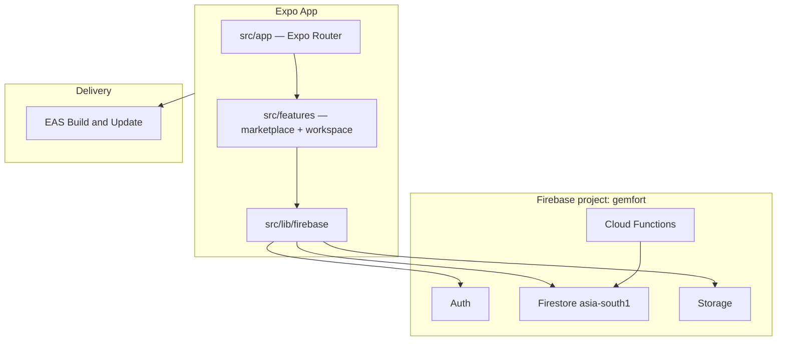

# GemFort

**Every stone has a story.**

GemFort is the mobile platform for the gemstone trade—pairing a verified trust network with private business operations built for how dealers actually work: AP stones, post-dated cheques, sourcing trips, lab certificates, and WhatsApp-first deals.

Trusted gems. Clear records. Real connections.

| | |
|---|---|
| Platforms | iOS · Android |
| Stack | Expo SDK 57 · React Native · Firebase |
| Domain | [gemfort.app](https://gemfort.app) |
| Support | [support@gemfort.app](mailto:support@gemfort.app) |
| Org | orbitratech |

---

## Purpose

GemFort gives gem businesses a single place to discover trusted counterparts and run the books that notebooks and WhatsApp cannot hold. It is not a generic marketplace checkout. Deals stay relationship-based; the app brings clarity to inventory, money, and reputation around those deals.

## Mission

Give every gem business clear records and trusted connections—so traders know where their stones and money are, and can find verified counterparts in Beruwala and connected markets.

## Vision

Become the default digital infrastructure for the Sri Lankan gem trade and its regional hubs—where verification, visibility, and reputation earn trust, and day-to-day operations remain free and zero-friction.

---

## The problem

Gem businesses in Sri Lanka and trading hubs across Bangkok and China still run on memory, physical notebooks, and informal WhatsApp threads. There is no digital tool built for the real workflows of the trade:

- Stones given **on approval (AP)** with return dates
- **Post-dated cheques** and maturity calendars
- Rough-to-cut **weight loss** and processing costs
- **Sourcing and selling trips** with shared overhead
- Knowing who is a verified cutter or lab in Beruwala

At any moment, a dealer often cannot answer: which stones are with whom, which cheques mature when, whether a gem is profitable after costs, or who is trustworthy to deal with.

---

## Two products

GemFort is one app with two pillars.

### GemNet — trust network & marketplace

Public discovery and reputation for the trade.

- Browse verified **traders**, **lapidaries**, and **gem labs** without signing in
- Business profiles with verification badges, NGJA signals, WhatsApp and call
- Gem listings with shareable public links (`https://gemfort.app/l/...`)
- Public **certificate verification** by report number
- Service and certification requests between traders and providers
- Manual identity verification (BR / NGJA documents; admin-approved)
- Fraud reports and platform announcements

### GemTrack — private workspace

Operational clarity for each business—role-gated modules.

| Module | What it does |
|--------|----------------|
| **Gems** | Private inventory lifecycle, costs, profit; publish to GemNet when ready |
| **AP** | Stones on approval with holders, return dates, and overdue alerts |
| **Services / Jobs** | Send stones to cutters; lapidaries track inbound jobs and weight loss |
| **Certificates** | Labs issue and manage reports |
| **Cheques** | Post-dated cheques, maturity calendar, bounce and replacement |
| **Money** | Income/expense, receivables/payables, commissions, sales, reports |
| **Trips** | Sourcing/selling trips with purchases, expenses, and linked gems |
| **Contacts** | Brokers, buyers, partners; phone import; Android call-log matching |
| **Requests** | Outgoing service and cert requests |

---

## Who it’s for

| Role | Focus |
|------|--------|
| **Trader** | Buy and sell stones; inventory, AP, trips, cheques, money, requests |
| **Lapidary** | Cutting, heating, polishing; jobs pipeline, services, money |
| **Gem Lab** | Issue and verify certificates; money |
| **Guest** | Directory, home, and certificate verify without an account |
| **Admin** | Platform operations; full module access |

### Workspace modules by role

| Role | Modules |
|------|---------|
| Trader | Gems, Trips, AP, Services, Money, Cheques, Requests |
| Lapidary | Services, Jobs, Money |
| Gem Lab | Certificates, Money |

Registration assigns a role immediately (unverified). Directory listing and marketplace publishing require verified status.

---

## What we don’t do

GemFort is intentional about scope:

- No payments between users
- No physical shipping or logistics
- No gem grading or certification by the platform itself
- No public auction house
- No star ratings or public review walls
- No social network features
- No processing of financial transactions

Deals close on WhatsApp, phone, and in person. GemFort tracks the work around those deals.

---

## Product surface

### Main tabs

| Tab | Purpose |
|-----|---------|
| **Home** | Feed, announcements, featured listings, upcoming workspace deadlines |
| **Directory** | Gems, traders, lapidaries, labs—search and filters |
| **Workspace** | GemTrack hub and modules (sign-in required) |
| **Profile** | Account, business profile, verification, preferences |

### Notable routes

| Surface | Path |
|---------|------|
| Onboarding / auth | `(auth)/onboarding`, `login`, `register`, `verify-otp` |
| Business profile | `business/[businessId]` |
| Public listing | `listing/[slug]` |
| Create listing | `listings/create` |
| Certificate verify | `verify-certificate` |
| Notifications | `notifications` |

### Deep links

- App scheme: `gemfort://`
- Universal links (preview / production): `https://gemfort.app/l/...`

---

## Architecture



| Layer | Location | Role |
|-------|----------|------|
| Screens / navigation | `src/app/` | Expo Router file-based routes |
| Domain logic | `src/features/marketplace/`, `src/features/workspace/` | Firestore services and business rules |
| UI | `src/components/` | Brand, marketplace, workspace, shared UI |
| Firebase | `src/lib/firebase/` | Auth, DB, storage, phone OTP, messaging |
| State | `src/providers/` | Auth, React Query, theme, toast, push |
| Backend | `functions/` | Scheduled jobs and Firestore triggers |
| Security | `firestore.rules`, `storage.rules`, `firestore.indexes.json` | Access control and indexes |

Path aliases: `@/*` → `./src/*`, `@/assets/*` → `./assets/*`.

---

## Tech stack

| Area | Choice |
|------|--------|
| App | Expo SDK 57, React Native 0.86, React 19, TypeScript |
| Navigation | Expo Router (typed routes, native tabs) |
| Data | TanStack React Query, Zod validation |
| Backend | Firebase Auth, Firestore, Storage, Cloud Functions (`asia-south1`) |
| Native Firebase | `@react-native-firebase/*` (requires a **development build**, not Expo Go) |
| Push | Expo Notifications + FCM |
| FX | Frankfurter API (LKR base; no API key) |
| Delivery | EAS Build, EAS Update |

---

## Getting started

### Prerequisites

- [Bun](https://bun.sh) (preferred; `bun.lock` is the lockfile) or Node.js 20+
- Android Studio and/or Xcode
- Access to the GemFort Firebase project and EAS (`orbitratech`)
- Google Services files for your bundle ID (see below)

### 1. Install

```bash
bun install
```

### 2. Environment

```bash
cp .env.example .env
```

Fill in Firebase web config values:

```bash
EXPO_PUBLIC_APP_ENV=development
EXPO_PUBLIC_FIREBASE_API_KEY=
EXPO_PUBLIC_FIREBASE_AUTH_DOMAIN=gemfort.firebaseapp.com
EXPO_PUBLIC_FIREBASE_PROJECT_ID=gemfort
EXPO_PUBLIC_FIREBASE_STORAGE_BUCKET=gemfort.firebasestorage.app
EXPO_PUBLIC_FIREBASE_MESSAGING_SENDER_ID=478360291449
EXPO_PUBLIC_FIREBASE_APP_ID=
```

One Firebase project (`gemfort`) is used across development, preview, and production. Native config files differ by bundle ID under `google-services/`.

### 3. Native Google Services

Place the correct files for your environment (or set `GOOGLE_SERVICES_JSON` / `GOOGLE_SERVICES_PLIST` for EAS):

| Env | Android package / iOS bundle | Typical files |
|-----|------------------------------|---------------|
| development | `app.gemfort.dev` | `google-services.json`, `GoogleService-Info.dev.plist` |
| preview | `app.gemfort.preview` | `…preview…` |
| production | `app.gemfort` | production Google Services |

### 4. Run a development build

React Native Firebase is **not** compatible with Expo Go. Use a local native build or an EAS development client.

```bash
# Local native run
bun run android
# or
bun run ios

# Metro for an already-installed dev client (LAN, port 8083)
bun run start:dev-client
```

First-time EAS development clients:

```bash
bun run build:dev:android
bun run build:dev:ios
```

---

## Environments and builds

| Profile | `EXPO_PUBLIC_APP_ENV` | Bundle ID | EAS channel | Distribution |
|---------|----------------------|-----------|-------------|--------------|
| development | `development` | `app.gemfort.dev` | `development` | Dev client, internal |
| preview | `preview` | `app.gemfort.preview` | `preview` | Internal |
| production | `production` | `app.gemfort` | `production` | Store |

OTA updates:

```bash
bun run update:dev
bun run update:preview
```

Runtime version follows app version (`app.config.ts`).

---

## Scripts

| Command | Purpose |
|---------|---------|
| `bun start` | Start Metro |
| `bun run start:dev-client` | Dev client Metro (LAN, port 8083) |
| `bun run android` / `ios` | Native run via Expo |
| `bun run prebuild` | Generate native projects |
| `bun run build:dev:android` / `:ios` | EAS development builds |
| `bun run build:preview:android` / `:ios` | EAS preview builds |
| `bun run update:dev` / `update:preview` | Publish EAS Update |
| `bun run lint` | ESLint |
| `bun run typecheck` | TypeScript (`tsc --noEmit`) |
| `bun run test` | Jest unit tests |
| `bun run test:rules` | Firestore rules tests |
| `bun run test:functions` | Cloud Functions tests |
| `bun run seed` | Seed marketplace data |
| `bun run seed:admin` | Seed admin user |
| `bun run seed:qa` | Seed QA fixtures |
| `bun run firebase:deploy` | Deploy rules, indexes, storage, functions |

npm works for the same scripts if Bun is unavailable; prefer Bun for install to match the lockfile.

---

## Backend

Cloud Functions live in `functions/` (region `asia-south1`).

| Area | Responsibility |
|------|----------------|
| **GemNet** | Announcements, verification status, fraud reports, account actions, service/cert request lifecycle |
| **GemTrack** | Daily workspace alerts, cheque bounced handling |
| **Notifications** | Push delivery when notification documents are created |

Deploy:

```bash
bun run firebase:deploy
```

This deploys Firestore rules, indexes, Storage rules, and Functions.

Schema and rules detail: [`plan/06-firestore-schema.md`](plan/06-firestore-schema.md), [`plan/07-security-rules.md`](plan/07-security-rules.md).

---

## Project layout

```text
gemfort/
├── src/
│   ├── app/                 # Expo Router screens
│   ├── components/          # UI (brand, marketplace, workspace)
│   ├── features/
│   │   ├── marketplace/     # GemNet services
│   │   └── workspace/       # GemTrack services
│   ├── constants/           # Roles, brand story, banks, design tokens
│   ├── lib/                 # Firebase, validation, FX, errors
│   ├── providers/           # Auth, query, theme, push
│   ├── hooks/
│   └── types/
├── functions/               # Cloud Functions
├── google-services/         # Per-env Firebase native config
├── assets/                  # Icons, splash, images
├── scripts/                 # Seed and rules test tooling
├── plan/                    # Internal product & technical specs
├── docs/qa/                 # Device QA evidence
├── app.config.ts
├── eas.json
├── firestore.rules
└── package.json
```

---

## Auth model

1. Guests can browse Home, Directory, and certificate verify.
2. Register with email/password and role (`trader` | `lapidary` | `gem_lab`).
3. Optional phone OTP links the credential and marks the phone verified.
4. Suspended accounts are signed out on login.
5. Workspace modules require a signed-in profile; orphan Auth users without a Firestore profile are signed out.

---

## Permissions

| Permission | Why |
|------------|-----|
| Photos | Upload gem and business images |
| Contacts | Import brokers, buyers, and partners |
| Call log (Android, read-only) | Match recent calls to workspace contacts |

---

## Internal documentation

This README is the product and contributor entry point. Deeper specifications live in the internal suite:

| Doc | Contents |
|-----|----------|
| [`plan/00-contents.md`](plan/00-contents.md) | Index of the full suite |
| [`plan/02-prd.md`](plan/02-prd.md) | Product requirements |
| [`plan/03-user-roles.md`](plan/03-user-roles.md) | Roles and verification |
| [`plan/06-firestore-schema.md`](plan/06-firestore-schema.md) | Data model |
| [`plan/08-ranking-algorithm.md`](plan/08-ranking-algorithm.md) | Directory ranking |
| [`plan/12-design-system.md`](plan/12-design-system.md) | Design system |
| [`plan/14-acceptance-criteria.md`](plan/14-acceptance-criteria.md) | Acceptance criteria |

Device QA artifacts (scorecard, findings, screenshots): [`docs/qa/`](docs/qa/).

Brand copy used in the app: [`src/constants/brand-story.ts`](src/constants/brand-story.ts).

For Expo SDK APIs, use the versioned docs for **SDK 57**: [docs.expo.dev/versions/v57.0.0](https://docs.expo.dev/versions/v57.0.0/).

---

## Security and privacy

- Role-based access is enforced in Firestore security rules.
- Verification is manual by design; badges are not self-asserted.
- Fraud reports are reviewed by GemFort; reporters are not exposed to the reported business.
- Platform privacy targets include Sri Lanka PDPA No. 9 of 2022 compliance (see PRD).
- Support: [support@gemfort.app](mailto:support@gemfort.app).

---

## Ownership

GemFort is a private product of **orbitratech**. This repository is not published as open source.

---

© orbitratech · GemFort
